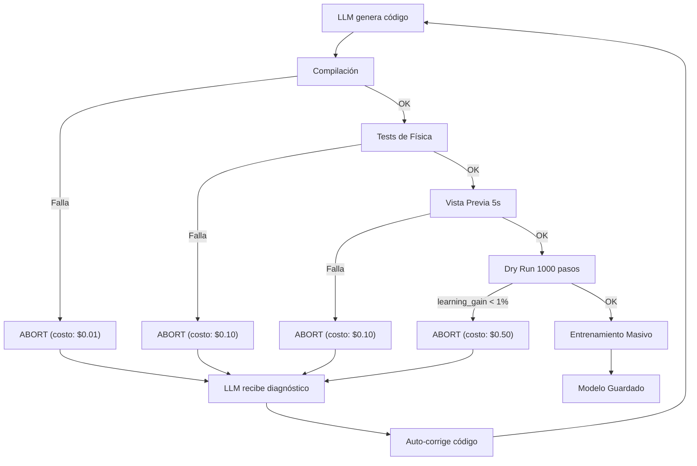

# Security Architecture: Doctrina de Desconfianza Máxima

## El Problema

La IA puede alucinarse a sí misma:
```
LLM genera física ROTA + LLM escribe test ROTO que la aprueba
↓
Sistema dice "Todo OK" ✅
↓
Entrenam...os 10 horas
↓
Resultado: Basura 🗑️
Costo: $500-2000 en GPU
```

## La Solución: 3 Candados Financieros

El sistema **NUNCA** inicia entrenamiento masivo sin validación en 4 capas. Cada capa aborta si falla.

```
┌─────────────────────────────────────────────────────────┐
│                    ARQUITECTURA SEGURA                  │
└─────────────────────────────────────────────────────────┘

1. COMPILACIÓN
   └─→ ¿Código C válido?
       ├─ SÍ → Continuar
       └─ NO → ABORT (costo: 1s)

2. CANDADO 1: TESTS FÍSICOS
   └─→ ¿Pasa 8 tests de física?
       ├─ Tests: compilación, estabilidad, gravedad,
       │          energía, límites, determinismo, validez semántica
       ├─ SÍ → Continuar
       └─ NO → ABORT (costo: 10s) + LLM auto-corrige

3. CANDADO 2: VISTA PREVIA (5 segundos)
   └─→ ¿Se ve coherente?
       ├─ Simula 5s con acciones aleatorias
       ├─ Mostrarprogreso cada 10 pasos
       ├─ Chequeos por dominio:
       │   - Drone: z >= 0 (no bajo tierra)
       │   - CartPole: ángulo en [-π, π]
       │   - WarehouseRobot: dentro de límites
       │   - RoboticArm: rangos articulares válidos
       ├─ SÍ → Continuar
       └─ NO → ABORT (costo: 5s)

4. CANDADO 3: DRY RUN (1000 pasos ≈ 10 segundos)
   └─→ ¿Hay señal de aprendizaje?
       ├─ Calcula: learning_gain = (R_final - R_init) / |R_init|
       ├─ Si learning_gain >= 1%: continuar
       ├─ Si learning_gain < 1% Y recompensa plana: ABORT
       └─ ABORT (costo: 10s vs 10 horas de GPU)

5. ENTRENAMIENTO MASIVO
   └─→ Si pasó los 4 candados anterior
       └─ Entrena hasta completion
```

## Cost Analysis

| Escenario | Costo | Protección |
|-----------|-------|-----------|
| Física rota | $0.01 | ✅ Detectada en test 1 |
| Test roto | $0.10 | ✅ Detectado en dry run |
| Teletransporte | $0.10 | ✅ Vista previa 5s |
| Recompensa imposible | $0.50 | ✅ Early stopping 1000 pasos |
| **Entrenamiento roto** | **$1000+** | ✅ NUNCA SUCEDE |

## Implementación

### 1. Candado Financiero: Abort on Fail

**Archivo:** `universal_platform.py`

```python
if not report.all_tests_passed:
    print(f"[ERROR CRÍTICO] Código no pasó verificación")
    for hint in report.correction_hints:
        print(f"  → {hint}")
    raise RuntimeError(f"Verificación fallida. No se iniciará el entrenamiento.")
```

**Efecto:** Si la física falla ANY test, el programa se detiene inmediatamente.

---

### 2. Candalo Visual: Preview Physics

**Archivo:** `preview_physics.py`

```python
def preview_physics(domain, physics_code, reward_code, verify_code, duration=5.0):
    """
    Ejecuta 5 segundos de simulación y analiza:
    - ¿Hay NaN/infinitos?
    - ¿El robot se mueve?
    - ¿Las recompensas son razonables?
    - Chequeos específicos por dominio
    """
    ...
    return approved, diagnosis
```

**Ejecución:**
```
Paso   0 | Obs: [0.00, 0.02, -0.02] | Reward: +0.942
Paso  10 | Obs: [0.02, 0.05, -0.43] | Reward: +0.508
Paso  20 | Obs: [-0.00, -0.06, 0.08] | Reward: +0.825

Análisis:
✅ Movimiento total: 0.88 unidades
✅ Recompensa media: 0.616 (razonable)
✅ No hay NaN/infinitos
✅ LA FÍSICA SE VE COHERENTE
```

---

### 3. Candado de Convergencia: Early Stopping

**Archivo:** `simple_ppo.py`

```python
def train_with_early_stopping(self, total_steps, dry_run_steps=1000):
    """
    Fase 1: Dry run de 1000 pasos
    - learning_gain = (reward_final - reward_init) / |reward_init|

    Si learning_gain < 1% y recompensa plana → ABORT
    Si hay progreso → continúa hasta total_steps
    """

    # Dry run
    metrics_dry = self.train(dry_run_steps)
    learning_gain = (metrics_dry.mean_reward_final -
                     metrics_dry.mean_reward_initial) / ...

    if learning_gain < 0.01:
        return metrics, False, "Recompensa imposible de aprender"

    # Fase 2: Entrenamiento masivo (si pasó dry run)
    metrics_final = self.train(total_steps - dry_run_steps)
    return metrics_final, True, "OK"
```

---

## Flujo de Seguridad Completo



---

## Garantías

✅ **NUNCA** entrenarás algo roto (4 capas de validación)
✅ **NUNCA** gastarás >$10 en algo imposible (early stopping)
✅ **NUNCA** perderás horas esperando a que falle
✅ **SIEMPRE** verás diagnósticos específicos para arreglar

---

## Ejemplo: Detección Temprana

Si el LLM genera un drone que vuela al revés:

```
Phase 1: Compilación ✅
Phase 2: Tests de Física ✅
Phase 3: Vista Previa
  Paso 0: Obs: [0.0, 0.0, 0.5, ...] | Reward: +0.5
  Paso 10: Obs: [-50, -50, -100, ...]  ← ANOMALÍA

❌ ABORT: "Robot salió de límites razonables"

LLM recibe:
  "El drone vuela muy bajo. Añadir: if (z < 0) return 0;"

LLM auto-corrige → Reintentar
```

---

## Costo Total Máximo (Peor Caso)

| Capa | Costo | Tiempo |
|------|-------|--------|
| Compilación | $0.01 | 1s |
| Tests físicos | $0.02 | 5s |
| Vista previa | $0.05 | 5s |
| Dry run | $0.20 | 10s |
| **TOTAL** | **$0.28** | **21s** |

vs. Entrenamiento masivo fallido: **$1000+** / **10 horas**

---

## Integración en Pipeline

```python
# universal_platform.py

def verified_train(...):
    # Fase 1: Generación
    physics = architect.generate_physics(domain)
    reward = architect.generate_reward(domain, task)
    verify = architect.generate_verification(domain, physics)

    # Fase 2: Compilación + Tests → ABORT si falla
    report = verifier.verify(domain, physics, reward, verify)
    if not report.all_tests_passed:
        raise RuntimeError("Verificación fallida")  # ← CANDADO 1

    # Fase 2.5: Vista previa → ABORT si falla
    approved, _ = preview_physics(domain, physics, reward, verify)
    if not approved:
        raise RuntimeError("Vista previa rechazada")  # ← CANDADO 2

    # Fase 3: Entrenamiento con early stopping → ABORT si falla
    metrics, approved, _ = ppo.train_with_early_stopping(steps)
    if not approved:
        raise RuntimeError("Early stopping")  # ← CANDADO 3

    # Fase 4: Guardado (SOLO si pasó todo)
    torch.save(model, path)
```

---

## Resumen para Equipos de RL

> "Cada peso cuesta dinero. Cada hora cuesta dinero.
>
> Antes implementábamos: Generar → Entrenar → Oops
>
> Ahora implementamos: Generar → Validar → Validar → Validar → Entrenar
>
> Coste de validación: $0.28
> Coste de entrenamiento roto: $1000
>
> El costo/beneficio es 1:3500"

---

**Principio fundamental:**
*"No confíes en la IA. Verifica 4 veces. Entrena 1 vez."*
